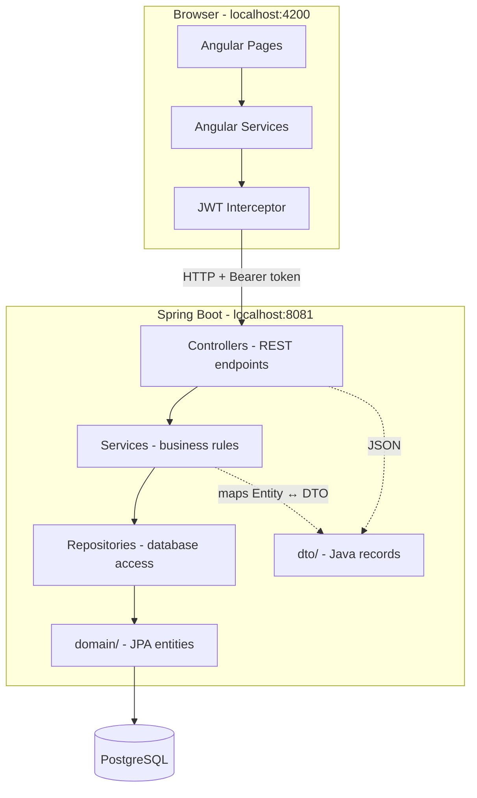

# NERD'S TECH — Project Breakdown

Full explanation of folders, files, architecture, API, and how everything connects.

---

## 1. What is this project?

A **full-stack e-commerce** application for a tech/gaming hardware store.


| Layer         | Technology                                               | Port   |
| ------------- | -------------------------------------------------------- | ------ |
| Frontend (UI) | Angular 21 — standalone components, signals, lazy routes | `4200` |
| Backend (API) | Spring Boot 4 — REST, JWT security, JPA                  | `8081` |
| Database      | PostgreSQL (`nerdstech`)                                 | `5432` |


The frontend talks to the backend over **HTTP REST**. The backend talks to PostgreSQL through **Spring Data JPA**.

---

## 2. Root folder structure

```
New folder/
├── frontend/              ← Angular SPA (what users see in the browser)
├── backend/               ← Spring Boot API (business logic + database)
├── docs/                  ← Extra documentation (CODE_DOCUMENTATION, PROJECT_REPORT)
├── break_down_project.md  ← This file
└── README.md              ← Quick start guide
```

---

## 3. Architecture (big picture)




### Request flow example: "Add to cart"

1. User clicks **+ Cart** on `/products` (Angular component).
2. `CartService.add()` sends `POST /api/cart/items` with JWT header.
3. `CartController` receives the request.
4. `CartService` validates stock, saves to database.
5. Returns `CartDto` (Java **record**) as JSON.
6. Angular updates the cart UI.

---

## 4. Backend (`backend/`)

### 4.1 Why layered architecture?

Each package has **one job** (SOLID — Single Responsibility):


| Package             | Role                                                  | Uses                     |
| ------------------- | ----------------------------------------------------- | ------------------------ |
| `domain/`           | Database tables as Java classes (JPA **entities**)    | `@Entity`, Lombok        |
| `repository/`       | Auto-generated SQL queries                            | `JpaRepository`          |
| `service/`          | Business rules, transactions                          | repositories + domain    |
| `controller/`       | HTTP entry points (public API)                        | services + DTOs          |
| `controller/admin/` | HTTP entry points (admin only)                        | services + DTOs          |
| `dto/`              | **Java `record`** — API input/output (JSON contracts) | validation annotations   |
| `security/`         | JWT login, filters, roles                             | Spring Security          |
| `config/`           | Startup seed data, catalog helpers                    | `DataSeeder`             |
| `exception/`        | Central error handling                                | `GlobalExceptionHandler` |
| `util/`             | Small helpers (`CurrentUser`, `PricingUtil`)          | —                        |


### 4.2 `domain/` — Entities (database models)

These are **mutable classes** (not records) because JPA/Hibernate needs setters and lifecycle management.


| File               | Table          | Purpose                                             |
| ------------------ | -------------- | --------------------------------------------------- |
| `User.java`        | `users`        | Accounts (email, password hash, role ADMIN/USER)    |
| `Product.java`     | `products`     | Catalog items (price, stock, category, active flag) |
| `Category.java`    | `categories`   | Product groups (Gaming PCs, Components, …)          |
| `Cart.java`        | `carts`        | One cart per user                                   |
| `CartItem.java`    | `cart_items`   | Lines inside a cart                                 |
| `Order.java`       | `orders`       | Placed orders                                       |
| `OrderItem.java`   | `order_items`  | Lines inside an order                               |
| `SiteContent.java` | `site_content` | CMS blocks (home hero, builds, support, footer)     |
| `Role.java`        | enum           | `USER`, `ADMIN`                                     |
| `OrderStatus.java` | enum           | `PENDING`, `PAID`, `SHIPPED`, …                     |
| `ContentType.java` | enum           | `PAGE`, `BANNER`, `FOOTER`, `ANNOUNCEMENT`          |


### 4.3 `dto/` — Records (SOLID / API contracts)

**This is what your course calls "record" in the norme SOLID context.**

Java `record` = immutable data carrier. Perfect for REST JSON because:

- **S**ingle Responsibility — only data, no business logic in controllers
- **I**nterface segregation — client sees `ProductDto`, not internal `Product` entity
- **D**ependency inversion — controllers depend on DTOs, not database entities

#### Request records (client → server)


| Record                                      | Used when                              |
| ------------------------------------------- | -------------------------------------- |
| `RegisterRequest`                           | `POST /api/auth/register`              |
| `AuthRequest`                               | `POST /api/auth/login`                 |
| `ProductRequest`                            | Admin create/update product            |
| `UserCreateRequest` / `UserUpdateRequest`   | Admin user CRUD                        |
| `CartItemRequest`                           | Add item to cart                       |
| `CheckoutRequest`                           | Place order from cart                  |
| `OrderCreateRequest` / `OrderUpdateRequest` | Admin order CRUD                       |
| `OrderItemRequest`                          | Shared line item inside order requests |
| `SiteContentRequest`                        | Admin CMS create/update                |


#### Response records (server → client)


| Record           | Returns                                          |
| ---------------- | ------------------------------------------------ |
| `AuthResponse`   | `{ token, user }` after login                    |
| `UserDto`        | User profile (shared — no duplicate nested type) |
| `ProductDto`     | Product with computed `onSale`, `savings`        |
| `CategoryDto`    | Category list                                    |
| `CartDto`        | Cart + items + total                             |
| `OrderDto`       | Order + items + customer email                   |
| `SiteContentDto` | CMS block                                        |
| `DealsResponse`  | Deals page payload                               |
| `ApiError`       | `{ status, message, timestamp }` on errors       |


#### Mapping pattern

DTOs often have a static `from(Entity)` method:

```java
// ProductDto.java
public static ProductDto from(Product p) { ... }
```

Service loads `Product` from DB → maps to `ProductDto` → controller returns JSON.

### 4.4 `repository/` — Database access

Spring generates SQL from method names:


| Repository              | Entity                                            |
| ----------------------- | ------------------------------------------------- |
| `UserRepository`        | `User`                                            |
| `ProductRepository`     | `Product` (+ custom `search`, `searchByCategory`) |
| `CategoryRepository`    | `Category`                                        |
| `CartRepository`        | `Cart`                                            |
| `OrderRepository`       | `Order`                                           |
| `SiteContentRepository` | `SiteContent`                                     |


### 4.5 `service/` — Business logic


| Service                 | Responsibility                                   |
| ----------------------- | ------------------------------------------------ |
| `AuthService`           | Register, login, JWT, `/me` profile              |
| `UserService`           | Admin user CRUD                                  |
| `ProductService`        | Catalog + admin product CRUD                     |
| `CategoryService`       | Category CRUD                                    |
| `CartService`           | Cart read/add/update/remove                      |
| `OrderService`          | Checkout, my orders, admin orders, stock updates |
| `ContentService`        | CMS public read + admin CRUD                     |
| `DealService`           | Discounted products aggregation                  |
| `PaymentService`        | Simulated Stripe intent                          |
| `RecommendationService` | Product recommendations                          |


### 4.6 `controller/` — REST API

#### Public + authenticated (`/api`)


| Controller                 | Base path              |
| -------------------------- | ---------------------- |
| `AuthController`           | `/api/auth`            |
| `ProductController`        | `/api/products`        |
| `CategoryController`       | `/api/categories`      |
| `CartController`           | `/api/cart`            |
| `OrderController`          | `/api/orders`          |
| `ContentController`        | `/api/content`         |
| `DealController`           | `/api/deals`           |
| `RecommendationController` | `/api/recommendations` |
| `PaymentController`        | `/api/payments`        |


#### Admin only (`/api/admin`)


| Controller                | Base path               |
| ------------------------- | ----------------------- |
| `AdminUserController`     | `/api/admin/users`      |
| `AdminProductController`  | `/api/admin/products`   |
| `AdminCategoryController` | `/api/admin/categories` |
| `AdminOrderController`    | `/api/admin/orders`     |
| `AdminContentController`  | `/api/admin/content`    |


### 4.7 `security/` — Authentication


| File                          | Role                                           |
| ----------------------------- | ---------------------------------------------- |
| `SecurityConfig.java`         | Which URLs need login vs admin role            |
| `JwtService.java`             | Create/validate JWT tokens                     |
| `JwtAuthFilter.java`          | Read `Authorization: Bearer …` on each request |
| `UserDetailsServiceImpl.java` | Load user for Spring Security                  |
| `JwtProperties.java`          | Secret + expiration from `application.yml`     |


### 4.8 `config/` — Startup


| File                      | Role                                                   |
| ------------------------- | ------------------------------------------------------ |
| `DataSeeder.java`         | Seeds demo users, tech catalog, CMS content on startup |
| `TechProductCatalog.java` | Image URLs and deal percentages per product name       |


### 4.9 Config file

`backend/src/main/resources/application.yml` — database URL, port `8081`, JWT secret, CORS for `localhost:4200`.

---

## 5. Complete API reference

Base URL: `http://localhost:8081/api`

### Auth


| Method | Path             | Auth | Body / response                    |
| ------ | ---------------- | ---- | ---------------------------------- |
| POST   | `/auth/register` | —    | `RegisterRequest` → `AuthResponse` |
| POST   | `/auth/login`    | —    | `AuthRequest` → `AuthResponse`     |
| GET    | `/auth/me`       | JWT  | → `UserDto`                        |


### Catalog (public)


| Method | Path                            | Notes                                 |
| ------ | ------------------------------- | ------------------------------------- |
| GET    | `/products?categoryId=&search=` | Active products only                  |
| GET    | `/products/{id}`                | Product detail                        |
| GET    | `/categories`                   | All categories                        |
| GET    | `/deals`                        | `DealsResponse`                       |
| GET    | `/content`                      | Published CMS blocks                  |
| GET    | `/content/{key}`                | e.g. `home-hero`, `builds`, `support` |


### Cart (logged-in user)


| Method | Path                                | Body              |
| ------ | ----------------------------------- | ----------------- |
| GET    | `/cart`                             | —                 |
| POST   | `/cart/items`                       | `CartItemRequest` |
| PUT    | `/cart/items/{productId}?quantity=` | —                 |
| DELETE | `/cart/items/{productId}`           | —                 |


### Orders (logged-in user)


| Method | Path               | Body                             |
| ------ | ------------------ | -------------------------------- |
| GET    | `/orders`          | My order history                 |
| POST   | `/orders/checkout` | `CheckoutRequest`                |
| GET    | `/orders/{id}`     | Own order only (ownership check) |


### Admin (ADMIN role)


| Resource   | GET list          | GET one              | POST | PUT | DELETE   |
| ---------- | ----------------- | -------------------- | ---- | --- | -------- |
| Users      | `/admin/users`    | `/admin/users/{id}`  | ✓    | ✓   | ✓        |
| Products   | `/admin/products` | —                    | ✓    | ✓   | ✓ (soft) |
| Categories | —                 | —                    | ✓    | ✓   | ✓        |
| Orders     | `/admin/orders`   | `/admin/orders/{id}` | ✓    | ✓   | ✓        |
| CMS        | `/admin/content`  | —                    | ✓    | ✓   | ✓        |


Orders also support: `PATCH /admin/orders/{id}/status`

---

## 6. Frontend (`frontend/`)

### 6.1 Entry points


| File                              | Role                                          |
| --------------------------------- | --------------------------------------------- |
| `src/main.ts`                     | Bootstraps Angular app                        |
| `src/app/app.ts`                  | Root shell (navbar/footer hidden on `/admin`) |
| `src/app/app.routes.ts`           | All URL routes                                |
| `src/app/app.config.ts`           | HTTP client + JWT interceptor                 |
| `src/environments/environment.ts` | `apiUrl: http://localhost:8081/api`           |


### 6.2 Folder map

```
frontend/src/app/
├── components/           ← Pages (UI)
│   ├── home/             ← Landing page
│   ├── products/         ← Catalog + filters
│   ├── product-detail/   ← Single product
│   ├── deals/            ← Sale items
│   ├── builds/           ← CMS-driven build cards
│   ├── support/          ← CMS-driven support cards
│   ├── about/            ← CMS about page
│   ├── cart/             ← Shopping cart CRUD
│   ├── checkout/         ← Place order
│   ├── orders/           ← Order history
│   ├── auth/
│   │   ├── login/
│   │   └── register/
│   └── admin/            ← CMS panel (ADMIN only)
│       ├── admin-layout/     ← Sidebar shell
│       ├── admin-dashboard/
│       ├── admin-products/
│       ├── admin-categories/
│       ├── admin-orders/
│       ├── admin-users/
│       └── admin-cms/
├── services/             ← HTTP calls to backend API
│   ├── auth.service.ts
│   ├── catalog.service.ts
│   ├── cart.service.ts
│   ├── order.service.ts
│   ├── admin.service.ts
│   └── content.service.ts
├── models/               ← TypeScript interfaces (mirror backend DTOs)
├── guards/
│   └── auth.guard.ts     ← authGuard, adminGuard
├── interceptors/
│   └── auth.interceptor.ts  ← Adds JWT to every request
├── layout/
│   ├── navbar/
│   └── footer/
├── shared/               ← Reusable widgets
│   ├── product-image/
│   └── product-price/
└── utils/                ← Helpers (errors, CMS JSON parse, product mapping)
```

### 6.3 Services ↔ API mapping


| Angular service  | Backend endpoints                                      |
| ---------------- | ------------------------------------------------------ |
| `AuthService`    | `/auth/login`, `/auth/register`, `/auth/me`            |
| `CatalogService` | `/products`, `/categories`, `/deals`                   |
| `CartService`    | `/cart`, `/cart/items`                                 |
| `OrderService`   | `/orders`, `/orders/checkout`, `/admin/orders`         |
| `AdminService`   | `/admin/users`, `/admin/products`, `/admin/categories` |
| `ContentService` | `/content`, `/admin/content`                           |


### 6.4 Models ↔ DTOs

TypeScript interfaces in `models/` mirror backend Java records:


| Frontend (`models/`) | Backend (`dto/`)               |
| -------------------- | ------------------------------ |
| `user.model.ts`      | `UserDto`, `AuthResponse`      |
| `product.model.ts`   | `ProductDto`, `ProductRequest` |
| `category.model.ts`  | `CategoryDto`                  |
| `cart.model.ts`      | `CartDto`                      |
| `order.model.ts`     | `OrderDto`                     |
| `content.model.ts`   | `SiteContentDto`               |


### 6.5 Routes

**Store (everyone):** `/`, `/products`, `/products/:id`, `/deals`, `/builds`, `/about`, `/support`, `/login`, `/register`

**User (login required):** `/cart`, `/checkout`, `/orders`

**Admin (ADMIN role):** `/admin`, `/admin/products`, `/admin/categories`, `/admin/orders`, `/admin/users`, `/admin/cms`

---

## 7. SOLID principles in this project


| Principle                     | Where you see it                                                                  |
| ----------------------------- | --------------------------------------------------------------------------------- |
| **S** — Single Responsibility | Controllers only route HTTP; services hold logic; DTOs only carry data            |
| **O** — Open/Closed           | New features = new controller/service methods without changing entities           |
| **L** — Liskov Substitution   | Spring `JpaRepository` interfaces — swap implementation without changing services |
| **I** — Interface Segregation | Separate public vs `admin` controllers; small focused DTOs per use case           |
| **D** — Dependency Inversion  | Services depend on `repository` interfaces, not raw SQL                           |


### Why `record` in `dto/` and `class` in `domain/`?


|                    | `domain/` (class)           | `dto/` (record)               |
| ------------------ | --------------------------- | ----------------------------- |
| Purpose            | Persist in PostgreSQL       | Serialize to/from JSON        |
| Mutability         | Mutable (JPA needs setters) | Immutable                     |
| Logic              | Relationships, lazy loading | Optional `from()` mapper only |
| Exposed to client? | **Never**                   | **Always**                    |


---

## 8. Data flow diagrams

### Login

```
LoginComponent → AuthService.login() → POST /api/auth/login
  → AuthService (backend) → UserDto + JWT
  → localStorage (token + user) → navbar shows user name
```

### Admin product create

```
admin-products form → AdminService.createProduct(ProductRequest body)
  → POST /api/admin/products → AdminProductController
  → ProductService.create() → ProductRepository.save()
  → ProductDto.from(product) → JSON back to Angular
```

### Checkout

```
checkout form → OrderService.checkout(address)
  → POST /api/orders/checkout → OrderService.checkout()
  → reads Cart, decrements stock, creates Order, clears cart
  → OrderDto → redirect to /orders
```

---

## 9. CMS dynamic pages

Content keys seeded in `DataSeeder`:


| Key         | Used on          | Body format             |
| ----------- | ---------------- | ----------------------- |
| `home-hero` | `/`              | Plain text title + body |
| `about`     | `/about`         | Plain text              |
| `footer`    | Footer component | Plain text              |
| `builds`    | `/builds`        | JSON array of cards     |
| `support`   | `/support`       | JSON array of cards     |


Edit at `**/admin/cms**`. Example builds body:

```json
[
  {"title":"Streamer Pro","description":"RTX 4070 · Ryzen 7","search":"Nebula","imageSeed":"streamer-pro"}
]
```

---

## 10. How to run

```powershell
# Terminal 1 — API
cd backend
.\run.cmd

# Terminal 2 — UI
cd frontend
npm start
```


| Role  | Email                                             | Password |
| ----- | ------------------------------------------------- | -------- |
| Admin | [admin@nerdstech.com](mailto:admin@nerdstech.com) | admin123 |
| User  | [user@nerdstech.com](mailto:user@nerdstech.com)   | user123  |


---

## 11. Recent DTO / SOLID fixes

1. `**AuthResponse**` — removed duplicate nested `UserDto`; now reuses `UserDto.java` (DRY).
2. `**OrderItemRequest**` — extracted shared record used by both `OrderCreateRequest` and `OrderUpdateRequest`.
3. `**package-info.java**` in `dto/` — documents why records are used for SOLID compliance.

---

## 12. Quick file lookup


| I need to…                | Open                                               |
| ------------------------- | -------------------------------------------------- |
| Change API URL            | `frontend/src/environments/environment.ts`         |
| Add a new page            | `frontend/src/app/app.routes.ts` + new component   |
| Add REST endpoint         | `backend/.../controller/` + `service/`             |
| Change database table     | `backend/.../domain/` entity                       |
| Change JSON shape         | `backend/.../dto/` record + `frontend/.../models/` |
| Change who can access URL | `backend/.../security/SecurityConfig.java`         |
| Seed demo data            | `backend/.../config/DataSeeder.java`               |
| Global styles             | `frontend/src/styles.scss`                         |


