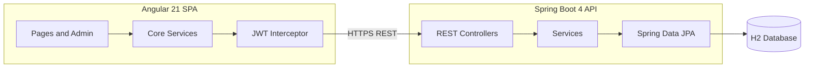

# Code Documentation — NERD'S TECH E-commerce

## 1. Architecture overview



The system follows a **three-tier** pattern: presentation (Angular), application (Spring services), and persistence (JPA/H2).

## 2. Backend (`backend/`)

### 2.1 Package layout

| Package | Responsibility |
|---------|----------------|
| `domain` | JPA entities: User, Product, Category, Cart, Order, SiteContent |
| `repository` | Spring Data JPA interfaces |
| `service` | Business logic and transactions |
| `controller` | Public REST endpoints under `/api` |
| `controller.admin` | Admin-only endpoints under `/api/admin` |
| `security` | JWT filter, SecurityFilterChain, password encoding |
| `dto` | Request/response records (API contracts) |
| `config` | Data seeding on startup |

### 2.2 Security model

- **Stateless JWT**: `POST /api/auth/login` and `/register` return a Bearer token.
- **Roles**: `ROLE_USER`, `ROLE_ADMIN` (method and URL rules).
- **Public reads**: products, categories, published CMS content, guest recommendations.
- **Authenticated**: cart, orders, checkout, payments intent.
- **Admin only**: `/api/admin/**` (users, products, categories, orders, CMS).

### 2.3 REST API summary

#### Authentication

| Method | Path | Description |
|--------|------|-------------|
| POST | `/api/auth/register` | Register buyer (creates cart) |
| POST | `/api/auth/login` | Login, returns JWT |
| GET | `/api/auth/me` | Current user profile |

#### Catalog (public)

| Method | Path | Description |
|--------|------|-------------|
| GET | `/api/products?categoryId=&search=` | List/filter products |
| GET | `/api/products/{id}` | Product detail |
| GET | `/api/categories` | List categories |
| GET | `/api/recommendations` | AI/popular recommendations |

#### Cart (authenticated)

| Method | Path | Description |
|--------|------|-------------|
| GET | `/api/cart` | Get user cart |
| POST | `/api/cart/items` | Add item `{ productId, quantity }` |
| PUT | `/api/cart/items/{productId}?quantity=` | Update quantity |
| DELETE | `/api/cart/items/{productId}` | Remove item |

#### Orders (authenticated)

| Method | Path | Description |
|--------|------|-------------|
| GET | `/api/orders` | Order history |
| POST | `/api/orders/checkout` | Checkout `{ shippingAddress, useStripe }` |
| GET | `/api/orders/{id}` | Order detail |

#### CMS (public read)

| Method | Path | Description |
|--------|------|-------------|
| GET | `/api/content` | Published content blocks |
| GET | `/api/content/{key}` | Content by key (e.g. `home-hero`) |

#### Admin

| Resource | CRUD base path |
|----------|----------------|
| Users | `/api/admin/users` |
| Products | `/api/admin/products` |
| Categories | `/api/admin/categories` |
| Orders | `/api/admin/orders` (+ PATCH status) |
| CMS | `/api/admin/content` |

#### Payments (optional)

| Method | Path | Description |
|--------|------|-------------|
| POST | `/api/payments/intent?amount=` | Simulated Stripe PaymentIntent |

### 2.4 Key classes

- **`JwtService`**: Token creation and validation (JJWT).
- **`CartService`**: Persistent cart per user; stock checks on add/update.
- **`OrderService`**: Checkout clears cart, decrements stock, optional simulated payment.
- **`RecommendationService`**: Suggests products by past order categories; falls back to popular items.
- **`ContentService`**: CMS for banners, pages, footer text.
- **`DataSeeder`**: Demo admin/user, sample products and CMS entries.

## 3. Frontend (`frontend/`)

### 3.1 Structure

| Path | Purpose |
|------|---------|
| `core/models` | TypeScript interfaces mirroring API DTOs |
| `core/services` | HTTP clients (auth, catalog, cart, orders, admin, content) |
| `core/guards` | `authGuard`, `adminGuard` |
| `core/interceptors` | Attaches `Authorization: Bearer` header |
| `pages/*` | Shop, cart, checkout, orders, auth |
| `pages/admin/*` | Admin layout + CRUD screens |
| `layout/navbar` | Global navigation |

### 3.2 Routing

- Lazy-loaded standalone components (Angular 21).
- Protected routes: cart, checkout, orders (`authGuard`).
- Admin subtree: `/admin/*` (`adminGuard`).

### 3.3 Configuration

- `src/environments/environment.ts`: `apiUrl: http://localhost:8080/api`

## 4. Configuration

### Backend `application.yml`

- `app.jwt.secret`, `app.jwt.expiration-ms`
- `app.cors.allowed-origins`: `http://localhost:4200`
- `app.stripe.enabled`: `false` (simulated checkout when `useStripe` is true)
- `app.ai.enabled`: recommendation module toggle

## 5. Extension points

1. **PostgreSQL**: Replace H2 datasource in `application.yml`; run with profile `prod`.
2. **Real Stripe**: Set `app.stripe.enabled=true` and integrate Stripe Java SDK in `PaymentService`.
3. **Advanced AI**: Replace rule-based `RecommendationService` with ML API or embeddings service.

## 6. Build commands

```bash
# Backend
cd backend && mvn clean package

# Frontend
cd frontend && npm run build
```
