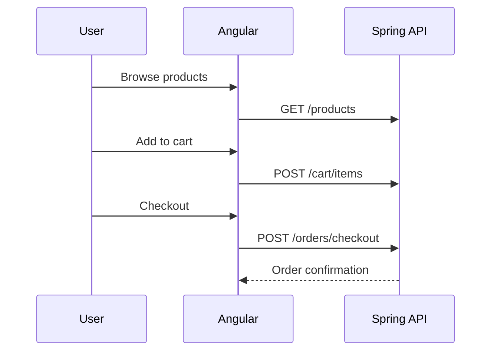
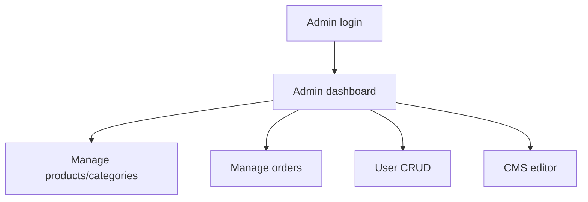

# Project Report — NERD'S TECH E-commerce

**Author:** NERD'S TECH  
**Stack:** Angular 21 · Spring Boot 4.0.6 · Java 21  
**Date:** May 2026

---

## 1. Executive summary

This project delivers a **full-stack e-commerce web application** aligned with the first-step project specification (PDF) and product vision: buyers browse products, manage carts, and place orders; administrators manage catalog, orders, users, and site content through a **content management system (CMS)**.

The implementation uses a **decoupled architecture**: an Angular 21 single-page application consumes a Spring Boot 4 REST API secured with **JWT** and role-based access control.

---

## 2. Objectives and scope

### 2.1 Primary objectives

| Objective | Status |
|-----------|--------|
| RESTful API for all core flows | ✅ Implemented |
| User registration and secure login | ✅ JWT-based |
| Product and category browsing/filtering | ✅ |
| Persistent shopping cart | ✅ Per-user in database |
| Checkout and order history | ✅ |
| Admin product/category/order management | ✅ |
| Admin user CRUD | ✅ |
| Admin CMS (pages, banners, footer) | ✅ |
| Code documentation | ✅ `docs/CODE_DOCUMENTATION.md` |
| Project report | ✅ This document |

### 2.2 Optional objectives (PDF)

| Feature | Implementation |
|---------|----------------|
| Payment (Stripe) | Simulated PaymentIntent when `useStripe` is enabled at checkout |
| AI recommendations | Rule-based engine using order history + popular fallback |

---

## 3. Actors and roles

### 3.1 User (buyer)

- Browse and search products
- View product details
- Add/update/remove cart items
- Checkout with shipping address
- View order history
- Receive product recommendations

### 3.2 Admin

- Full **user CRUD** (create, read, update, delete)
- Manage products and categories
- View all orders and update order status
- Manage CMS entries (hero banner, about page, footer, announcements)

---

## 4. Functional modules

### 4.1 Authentication and authorization

- Registration creates a `USER` account and empty cart.
- Login returns JWT; frontend stores token and user profile in `localStorage`.
- Spring Security enforces route-level and role-based rules.

### 4.2 Product and category management

- Public catalog with optional `categoryId` and `search` query parameters.
- Admin CRUD for products (price, stock, image URL, active flag) and categories.

### 4.3 Cart management

- One cart per user (1:1 relationship).
- Quantity updates respect available stock.
- Cart survives sessions (database-backed).

### 4.4 Order and checkout

- Checkout converts cart lines to order lines, reduces stock, clears cart.
- Order statuses: `PENDING`, `PAID`, `SHIPPED`, `DELIVERED`, `CANCELLED`.
- Admin can transition order status.

### 4.5 Content management system (CMS)

- `SiteContent` entities with unique `contentKey`, `type` (PAGE, BANNER, FOOTER, ANNOUNCEMENT), and `published` flag.
- Public API serves published content for storefront (e.g. home hero).
- Admin API provides full CRUD.

### 4.6 Payment integration (optional)

- Checkout flag `useStripe` marks order as `PAID` with simulated `paymentIntentId`.
- Dedicated endpoint creates payment intents for future Stripe.js integration.

### 4.7 AI recommendation module (optional)

- Logged-in users: recommendations weighted by categories from past orders.
- Guests: top active products.
- Toggle via `app.ai.enabled`.

---

## 5. Workflows

### 5.1 User flow

### 5.2 Admin flow

---

## 6. Technical decisions

| Decision | Rationale |
|----------|-----------|
| Java 21 | Required by specification; LTS features and performance |
| Spring Boot 4.0.6 | Latest generation per project requirements |
| H2 file database | Zero-config local development; easy demo |
| JWT vs sessions | Stateless API suitable for SPA |
| Angular standalone components | Default in Angular 21; smaller bundles with lazy routes |
| DTO records | Clear API contracts and validation |

---

## 7. Testing and quality

- Frontend production build verified (`ng build`).
- Backend: run `mvn test` after installing Maven.
- Manual test script:
  1. Start backend and frontend.
  2. Login as `user@nerdstech.com` / `user123`.
  3. Add products, checkout, verify orders.
  4. Login as `admin@nerdstech.com` / `admin123`.
  5. Update CMS, create user, change order status.

---

## 8. Deployment considerations

- Configure production JWT secret and HTTPS.
- Replace H2 with PostgreSQL for production.
- Set `app.cors.allowed-origins` to production Angular URL.
- Build frontend: `ng build`; serve `dist/frontend/browser` via CDN or nginx.
- Package backend: `mvn package`; run `java -jar target/ecommerce-api-1.0.0.jar`.

---

## 9. Future improvements

1. Integration tests (REST Assured, Cypress e2e).
2. Real Stripe Checkout and webhooks.
3. ML-based recommendations (collaborative filtering or LLM suggestions).
4. Product image upload (S3/blob storage).
5. Email notifications for order confirmation.

---

## 10. Conclusion

The NERD'S TECH e-commerce platform meets the **core academic and functional requirements** from the project PDF: modular REST backend, modern Angular storefront, admin operations including **user CRUD** and **CMS**, plus optional payment and AI layers. The codebase is documented, runnable locally, and structured for continuous improvement toward production deployment.

**Reference architecture:** Spring Boot + Angular full-stack e-commerce (NERD'S TECH implementation).
