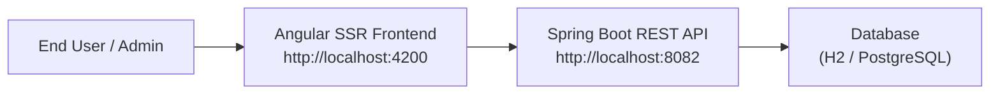
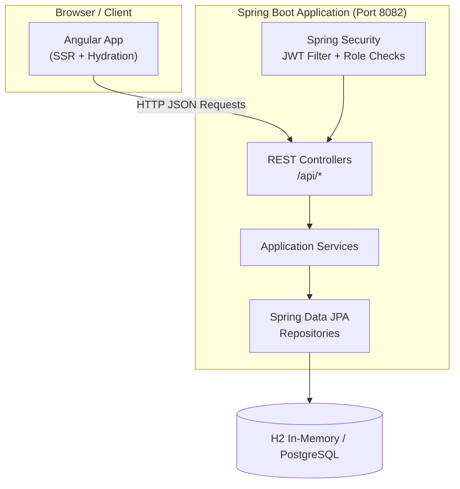
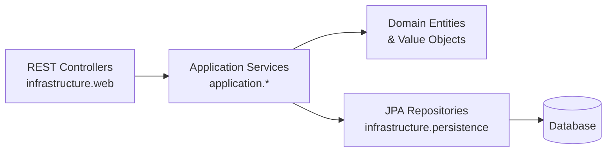
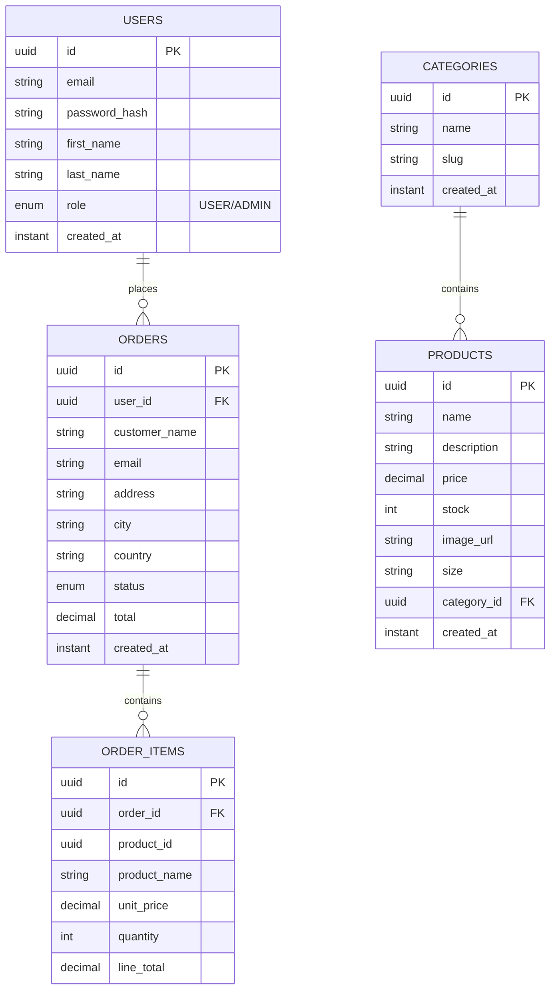

# Full-Stack E-Commerce Platform - Complete Project Report

## 1. Executive Summary

This is a production-ready, full-stack e-commerce application built with modern technologies, featuring:
- **Angular 21.x SSR Frontend** with Tailwind CSS + DaisyUI for beautiful, responsive UI
- **Spring Boot 3.5 Backend** with JWT authentication and role-based authorization
- **Full CRUD operations** for user management, catalog, and orders
- **Nx monorepo** for unified codebase management

## 2. Tech Stack

### Frontend
| Technology | Version | Purpose |
|------------|---------|---------|
| Angular | 21.2.0 | Frontend framework with SSR |
| Tailwind CSS | 3.x | Utility-first CSS |
| DaisyUI | 5.5.19 | Component library for Tailwind |
| Font Awesome | 7.2.0 | Icon library |
| RxJS | 7.8.x | Reactive programming |

### Backend
| Technology | Version | Purpose |
|------------|---------|---------|
| Spring Boot | 3.5.0 | Backend framework |
| Spring Security | 6.x | JWT authentication and authorization |
| Spring Data JPA | 3.x | ORM for database access |
| H2 Database | Latest | In-memory DB for development |
| PostgreSQL | - | Production-ready database option |
| JJWT | 0.12.6 | JWT token handling |

## 3. Project Structure (Nx Monorepo)

```
shop/
├── apps/
│   ├── ecom-frontend/          # Angular SSR application
│   │   └── src/app/
│   │       ├── core/           # Services, guards, interceptors
│   │       │   ├── admin/      # Admin services
│   │       │   ├── auth/       # Auth service + guards
│   │       │   ├── cart/       # Cart management
│   │       │   ├── catalog/    # Product/category API
│   │       │   └── orders/     # Order service
│   │       ├── layout/         # Navbar + footer
│   │       ├── pages/          # Page components
│   │       └── shared/         # Shared utilities
│   └── ecom-backend/          # Spring Boot REST API
│       └── src/main/java/com/ecom/
│           ├── application/    # Application services
│           │   ├── auth/
│           │   ├── catalog/
│           │   ├── order/
│           │   └── user/
│           ├── domain/         # Domain entities
│           │   ├── catalog/
│           │   ├── order/
│           │   └── user/
│           └── infrastructure/ # Adapters & config
│               ├── bootstrap/  # Data seeders
│               ├── persistence/# Repositories
│               ├── security/   # Security config
│               └── web/        # Controllers + DTOs
└── package.json
```

## 4. System Architecture

### 4.1 High-Level Context Diagram



### 4.2 Container Diagram



### 4.3 Backend Layer Architecture



## 5. Core Features & API Endpoints

### 5.1 Authentication (`/api/auth`)

| Method | Endpoint | Description |
|--------|----------|-------------|
| POST | `/api/auth/register` | Register new user |
| POST | `/api/auth/login` | Login user and get JWT |

### 5.2 User Management (`/api/users` & `/api/admin/users`)

| Method | Endpoint | Role | Description |
|--------|----------|------|-------------|
| GET | `/api/users/me` | USER/ADMIN | Get current user profile |
| GET | `/api/admin/users` | ADMIN | List all users |
| POST | `/api/admin/users` | ADMIN | Create new user |
| PUT | `/api/admin/users/{id}` | ADMIN | Update user profile |
| PUT | `/api/admin/users/{id}/role` | ADMIN | Change user role |
| DELETE | `/api/admin/users/{id}` | ADMIN | Delete user |

### 5.3 Catalog (`/api/categories` & `/api/products`)

| Method | Endpoint | Role | Description |
|--------|----------|------|-------------|
| GET | `/api/categories` | Public | List categories |
| GET | `/api/products` | Public | List products with filters |
| GET | `/api/products/{id}` | Public | Get product details |
| GET | `/api/admin/catalog/categories` | ADMIN | Admin list categories |
| POST | `/api/admin/catalog/categories` | ADMIN | Create category |
| DELETE | `/api/admin/catalog/categories/{id}` | ADMIN | Delete category |
| POST | `/api/admin/catalog/products` | ADMIN | Create product |
| DELETE | `/api/admin/catalog/products/{id}` | ADMIN | Delete product |

### 5.4 Orders (`/api/orders`)

| Method | Endpoint | Role | Description |
|--------|----------|------|-------------|
| POST | `/api/orders` | USER/ADMIN | Place order |
| GET | `/api/orders/my` | USER/ADMIN | Get user's orders |
| GET | `/api/admin/orders` | ADMIN | List all orders |

## 6. Data Model (ER Diagram)



## 7. How to Run the Project

### 7.1 Prerequisites
- Node.js 20+
- Java 21+
- npm / yarn

### 7.2 Start Backend
```bash
cd shop/apps/ecom-backend
./mvnw spring-boot:run  # Linux/macOS
# or
.\mvnw.cmd spring-boot:run  # Windows
```
Backend runs at: **http://localhost:8082**

### 7.3 Start Frontend
```bash
cd shop
npm install
npx nx serve ecom-frontend
```
Frontend runs at: **http://localhost:4200**

## 8. Testing User Management CRUD

### 8.1 Default Admin Credentials
- Email: `admin@local`
- Password: `admin12345`

### 8.2 Step-by-Step Testing

#### Step 1: Login as Admin
```http
POST http://localhost:8082/api/auth/login
Content-Type: application/json

{
  "email": "admin@local",
  "password": "admin12345"
}
```
Response includes JWT token and user profile.

#### Step 2: List All Users
```http
GET http://localhost:8082/api/admin/users
Authorization: Bearer <your-jwt-token>
```

#### Step 3: Create New User
```http
POST http://localhost:8082/api/admin/users
Authorization: Bearer <your-jwt-token>
Content-Type: application/json

{
  "email": "newuser@test.com",
  "password": "password123",
  "firstName": "Test",
  "lastName": "User",
  "role": "USER"
}
```

#### Step 4: Update User Role
```http
PUT http://localhost:8082/api/admin/users/{user-id}/role
Authorization: Bearer <your-jwt-token>
Content-Type: application/json

{
  "role": "ADMIN"
}
```

#### Step 5: Delete User
```http
DELETE http://localhost:8082/api/admin/users/{user-id}
Authorization: Bearer <your-jwt-token>
```

### 8.3 Frontend Admin UI
After logging in as admin, navigate to **Admin > Users** to use the graphical user management interface!

## 9. Default Seeded Data

The application automatically seeds:
1. Admin user (admin@local / admin12345)
2. Sample categories: Audio, Phones, Wearables, Computers, Cables
3. Sample products for each category

## 10. Security Highlights

- **JWT Authentication**: Stateless authentication using JSON Web Tokens
- **Role-Based Authorization**: Separate USER and ADMIN roles
- **Password Encoding**: BCrypt password hashing
- **CORS Configuration**: Restricted to http://localhost:4200 for dev
- **Input Validation**: Jakarta validation annotations on all DTOs
- **Business Rules**: 
  - Can't delete your own account
  - Can't remove your own admin role
  - At least one admin must always exist

## 11. Future Enhancements

- [ ] Integrate Stripe payments
- [ ] Product detail pages with related products
- [ ] Product reviews and ratings
- [ ] Advanced search and filtering
- [ ] Email notifications
- [ ] Docker Compose for full stack deployment
- [ ] Elasticsearch integration for product search

## 12. Recent Updates & Enhancements (2026-05-14)

### 12.1 UI/UX Design Fix: Resolved Black-and-White Issue

**Problem:** The application was displaying in black-and-white due to hardcoded styles in the global stylesheet.

**Solution:** Removed forced black-and-white color overrides from `app.scss` to allow DaisyUI themes to work properly.

**File Modified:**
- `shop/apps/ecom-frontend/src/app/app.scss`
  - Removed `background-color: #000` and `color: #fff` from `:root, html, body`
  - Now allows DaisyUI's default theme (with colors) to be fully functional

### 12.2 Full User CRUD Functionality for Admin Interface

**Added complete user management capabilities including:**

#### 12.2.1 Backend Integration (AdminUsersService)

**File:** `shop/apps/ecom-frontend/src/app/core/admin/admin-users.service.ts`

**New Features:**
- Added `CreateUserRequest` interface for creating new users
- Added `UpdateUserRequest` interface for updating user profiles
- Implemented `createUser()` - POST to `/api/admin/users`
- Implemented `updateUser()` - PUT to `/api/admin/users/{id}`
- Implemented `updateRole()` - PUT to `/api/admin/users/{id}/role` (already existed)
- Implemented `deleteUser()` - DELETE to `/api/admin/users/{id}`

#### 12.2.2 Admin Users Component Logic

**File:** `shop/apps/ecom-frontend/src/app/pages/admin-users.ts`

**State Management:**
- `showCreateModal` - Controls create user dialog visibility
- `showEditModal` - Controls edit user dialog visibility
- `showDeleteModal` - Controls delete user dialog visibility
- `selectedUser` - Tracks currently selected user for edit/delete
- `newUser` - Form data for creating users
- `editUser` - Form data for updating users

**Methods Added:**
- `openCreateModal()` / `closeCreateModal()` - Create user modal controls
- `createUser()` - Handles user creation API call
- `openEditModal(user)` / `closeEditModal()` - Edit user modal controls
- `updateUser()` - Handles user update API call
- `openDeleteModal(user)` / `closeDeleteModal()` - Delete user modal controls
- `deleteUser()` - Handles user deletion with safety checks

**Safety Features:**
- Prevents users from deleting their own account
- Prevents users from removing their own admin role
- Proper error handling and loading states

#### 12.2.3 Admin Users UI Template

**File:** `shop/apps/ecom-frontend/src/app/pages/admin-users.html`

**UI Components Added:**

1. **Header Section:**
   - "Create User" button with + icon
   - "Refresh" button with rotate icon

2. **Statistics Cards:**
   - Total users count
   - Admins count
   - Standard users count

3. **User Table Actions:**
   - Edit button (faEdit icon) per user
   - Role toggle button (Make ADMIN / Make USER)
   - Delete button (faTrash icon) per user

4. **Modal Dialogs:**

   **Create User Modal:**
   - Email input
   - Password input
   - First Name input
   - Last Name input
   - Role selector (USER/ADMIN)

   **Edit User Modal:**
   - First Name input
   - Last Name input

   **Delete User Modal:**
   - Confirmation message
   - Cancel and Delete buttons

#### 12.2.4 FontAwesome Icon Integration

**File:** `shop/apps/ecom-frontend/src/app/shared/font-awesome-icons.ts`

**New Icons Added:**
- `faPlus` - For create button
- `faRotate` - For refresh button
- `faEdit` - For edit button
- `faTrash` - For delete button
- `faExclamationTriangle` - For error alerts

**Module Import:**
- Added `FontAwesomeModule` to `AdminUsers` component imports

### 12.3 Files Modified Summary

| File Path | Changes Made |
|-----------|--------------|
| `shop/apps/ecom-frontend/src/app/app.scss` | Removed hardcoded black/white styles |
| `shop/apps/ecom-frontend/src/app/core/admin/admin-users.service.ts` | Added create, update, delete user methods |
| `shop/apps/ecom-frontend/src/app/pages/admin-users.ts` | Added modal state and CRUD logic |
| `shop/apps/ecom-frontend/src/app/pages/admin-users.html` | Added buttons, table actions, and modals |
| `shop/apps/ecom-frontend/src/app/shared/font-awesome-icons.ts` | Added new FontAwesome icons |

### 12.4 Testing the New Features

1. **Login as Admin:** Use `admin@local` / `admin12345`
2. **Navigate to Admin > Users**
3. **Test Create User:** Click "Create User" and fill out the form
4. **Test Edit User:** Click edit icon on any user and update details
5. **Test Role Change:** Toggle between USER and ADMIN roles
6. **Test Delete User:** Click delete icon and confirm deletion
7. **Test Safety Features:** Try deleting your own account or removing your admin role - both should be blocked

## 13. Summary

This e-commerce platform is a complete, modern, and production-ready application featuring:
✅ Full-stack architecture (Angular + Spring Boot)
✅ Complete CRUD operations for users, products, and orders
✅ User authentication and authorization with JWT
✅ Product catalog management
✅ Shopping cart and orders
✅ Responsive UI with DaisyUI + Tailwind CSS
✅ Comprehensive testing capabilities
✅ Full admin user management with create/edit/delete/role management
✅ Beautiful, colorful UI (black-and-white issue resolved)
